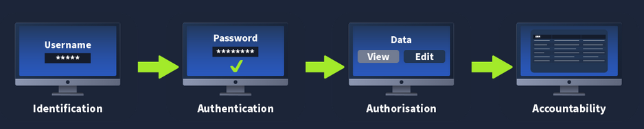

_This is my note about session management follow as article in TryHackMe, you can found it [here](https://tryhackme.com/room/sessionmanagement)_
## Session management lifecycle

> The session is used by the web application to keep your state, track your actions and decide whether or not you are allowed to do what you are trying to do 

+ Session creation : once you provide your username and password, you receive a session value that is sent with each new request

+ Session tracking : with each request made, the web application can recover the session value from the request and perform a sever-side lookup to understand who the session belongs to and what permissions they have

+ Session expiry : because the HTTP protocol is stateless, it may happen that a user of the web application all of a sudden stops using it

> Example : you might close the tab or your entire browser → since the protocol is stateless, the web application has no method to know that this action has occurred
And this is the where session expiry comes into play Your session value itself should have a lifetime attached to it. If the lifetime expires and you submit an old session value to the web application, it should be denied as the session should have been expired. Instead, you should be redirected to the login page to authenticate again and start the session management lifecycle all over again!

+ Session termination : However, in some cases, the user might forcibly perform a logout action. In the event that this occurs, the web application should terminate the user's session. While this is similar to session expiry, it is unique in the sense that even if the session's lifetime is still valid, the session itself should be terminated. Issues in this termination process could allow a threat actor to gain persistent access to an account.

## Authentication and Authorisation

+ Identification : Identification is the process of verifying who the user is. This starts with the user claiming to be a specific identity. In most web applications, this is performed by submitting your username. You are claiming that you are the person associated with the specific username. Some applications use uniquely created usernames, whereas others will take your email address as the username.

+ Authentication : Authentication is the process of ensuring that the user is who they say they are. Where in identification, you provide a username, for authentication, you provide proof that you are who you say you are. For example, you can supply the password associated with the claimed username. The web application can confirm this information if it is valid; this is the point where session creation would kick in.

+ Authorisation is the process of ensuring that the specific user has the rights required to perform the action requested. For example, while all users may view data, only a select few may modify it. In the session management lifecycle, session tracking plays a critical role in authorisation.

+ Accountability is the process of creating a record of the actions performed by users. We should track the user's session and log all actions performed using the specific session. This information plays a critical role in the event of a security incident to piece together what has happened.

## Cookies and Tokens

+ Cookie-based session management : is often called the old-school  way of managing sessions
Once the web application wants to begin tracking, in a response, the Set-Cookie header value will be sent . Your browser will interpret this header to store a new cookie value

> Set-Cookie: session=12345;

> Your browser will create a cookie entry for a cookie named session with a value of 12345 which will be valid for the domain where the cookie was received from.

> Secure - Indicates to the browser that the cookie may only be transmitted over verified HTTPS channels. If there are certificate errors or HTTP is used, the cookie value will not be transmitted.
HTTPOnly - Indicates to the browser that the cookie value may not be read by client-side JavaScript.
Expire - Indicates to the browser when a cookie value will no longer be valid and should be removed.
SameSite - Indicates to the browser whether the cookie may be transmitted in cross-site requests to help protect against CSRF attacks.

> A key thing to remember with cookie-based authentication is that the browser itself will decide when a certain cookie value will be sent with a request. After reviewing the domain and the attributes of the cookie, the browser makes this decision, and the cookie is attached automatically without any additional client-side JavaScript code.

+ Token-based session management
> Token-based session management is a relatively new concept. Instead of using the browser's automatic cookie management features, it relies on client-side code for the process. After authentication, the web application provides a token within the request body. Using client-side JavaScript code, this token is then stored in the browser's LocalStorage. 
> When a new request is made, JavaScript code must load the token from storage and attach it as a header. One of the most common types of tokens is JSON Web Tokens (JWT), which are passed through the Authorization: Bearer header. However, as we are not using the browser's built-in cookie management features, it is a bit of the wild west where anything goes. Although there are standards, nothing is really forcing anything from sticking to these standards.

| Cookie-Session Management | Token-Based Session Management |
|:-----|:------:|
| Cookie is automatically sent by the browser with each request    |   Token has to be submitted as a header with each request using client-side JavaScript    |
| Cookie attributes can be used to enhance the browser's protection of the cookie    |  Tokens do not have automatic security protections enforced and should, therefore, be safeguarded against disclosures     |
| Cookies can be vulnerable to conventional client-side attacks such as CSRF, where the browser is tricked into making a request on behalf of the user.    |   As the token is not automatically added to any request and cannot be read from LocalStorage by other domains, conventional client-side attacks such as CSRF are blocked. |
| As cookies are locked to a specific domain, it can be difficult to use them securely in decentralised web applications.    |  Tokens work well in decentralised web applications, as they are managed through JavaScript and can often contain all the information required to verify the token itself.     |

---
_Above note is just some basic overview about session management :s_
